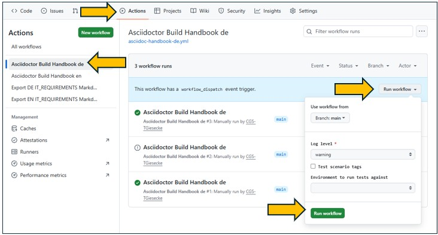
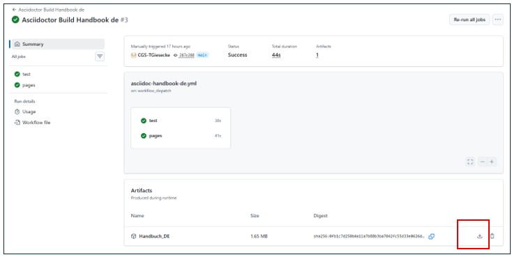

# Assist-user manuals

User handbook in German and English. 
Change these places from "CGS Assist" to "Arc Assist" or back

*Change in dir "de" or "en" docs/index.adoc*

- line 1 and 2
- line 4 and 5
- line 9 and 10 (Flag to change places in files)

*github action "asciidoc-handbook-de.yml"*

- line 53 change "pdf-theme=ARC"  to "pdf-theme=CGS" 

*github action "asciidoc-handbook-en.yml"*

- line 53 change "pdf-theme=ARC"  to "pdf-theme=CGS" 

After needed changes the related action can start manually to build pdf from assciidoc file.

After run the finished artifact can be download as zip file here.

