# ARC Assist Anwenderhandbuch

| Version | Autor | Datum     |
| ------- | ----- | --------- |
| 2.0     | CGS   | 02.02.2026|

### Inhaltsverzeichnis
- 1 [Anwendungsbeschreibung](#1-anwendungsbeschreibung)
- 1.1 [Assist Anwendung](#11-assist-anwendung)
- 1.1.1 [Navigationsbereich "KI Chat"](#111-navigationsbereich-ki-chat)
- 1.1.2 [Navigationsbereich "Anwendungsfälle"](#112-navigationsbereichn-anwendungsfälle)
- 1.1.3 [Navigationsbereich "Automatisierung"](#113-navigationsbereich-automatisierung)
- 1.1.4 [Navigationsbereich "Dokumente"](#114-navigationsbereich-dokumente)
- 1.2 [Assist Administration](#12-assist-administration)
- 1.2.1 [Benutzerverwaltung](#121-benutzerverwaltung)
- 1.2.1.1 [Benutzer bearbeiten](#1211-benutzer-bearbeiten)
- 1.2.2 [Rollenverwaltung](#122-rollenverwaltung)
- 1.2.2.1 [Rollen bearbeiten](#1221-rollen-bearbeiten)
- 1.2.3 [Ordnerverwaltung](#123-ordnerverwaltung)
- 1.2.4 [Systemaufforderung](#124-systemaufforderung)
- 1.2.5 [LLMs und Einbettungsmodelle](#125llms-und-einbettungsmodelle)
- 1.2.6 [Anwendungsfälle](#126-anwendungsfälle)
- 1.2.7 [Lizenzverwaltung](#127-lizenzverwaltung)
- 2 [Kontakt](#2-kontakt)

## 1. Anwendungsbeschreibung 

Es ist innerhalb von ARC Assist, im weiteren nur noch Assist genannt, möglich, KI-unterstütztes Unternehmenswissen in separaten Chats oder vorbereiteten Anwendungsfällen abzufragen und zu nutzen. 
Dieses Wissen basiert auf den Inhalten der hinterlegten Dokumente.
Alle Chatverläufe und Use Case Verläufe werden gespeichert und können auch nach dem Browser schließen und Neuanmeldung wieder geöffnet werden.
Bestimmte regelmäßige Anwendungsfälle werden im Assist als Templates verwaltet, um Routinen zu vereinfachen. Die Anwendungsfälle sind mit Use Cases wie eine Art Checkliste erstellt.

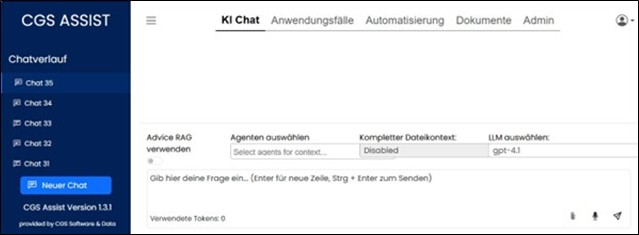

Über eine Navigation am oberen Rand sind die thematisierten Navigationsbereiche erreichbar.

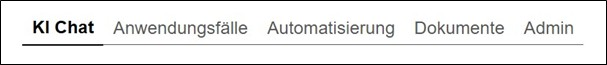

Unterseiten dieser Navigationsbereiche sind dann jeweils über die Baumnavigation am linken Rand erreichbar.

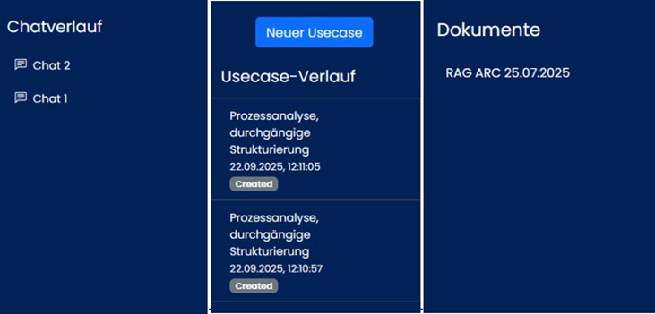

Zusätzlich kann über ein Symbol am rechten oberen Rand die Auswahl der Sprache innerhalb der Anwendung getroffen werden und die Ansicht in den Dark Mode, bzw. wieder zurück, gewechselt werden. 
Auch kann das Profil eingesehen werden bzw. eine Änderung des persönlichen Passwortes ist möglich.

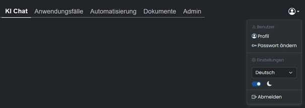
 
### 1.1 Assist Anwendung

#### 1.1.1 Navigationsbereich "KI Chat"

Hier können einzelne Anfragen gestartet werden. Diese lassen sich in Chats organisieren und werden systemseitig gespeichert, d.h. sie sind auch nach Sitzungsende weiterhin verfügbar.
Es kann vor dem Ausführen von Anfragen ausgewählt werden, ob der Dokumentenspeicher oder die Datenbank zur Wissensfindung durchsucht werden sollen. Beides gleichzeitig ist nicht möglich.
Es bestehen die Möglichkeiten zur Anfrage über eine manuelle Texteingabe, über eine Sprachaufnahme per Mikrofon oder das Laden eines Dokumentes.

Die Inhalte lassen sich mit einem „Copy“ Button in der Zwischenablage speichern zur weiteren Verarbeitung.

Um einen Chat umzubenennen, kann der Edit Button (Stift) benutz werden.
Um einen Chat im linken Baummenü zu löschen, muss zuerst der Löschen Button betätigt werden und das Löschen mit Klick auf den Haken bestätigt werden.

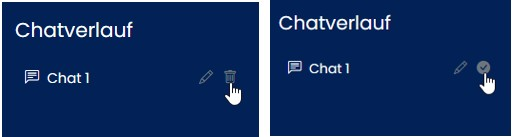

#### 1.1.2 Navigationsbereich "Anwendungsfälle" 

Hier werden alle aktivierten Anwendungsfälle, nach den Bereichen gruppiert, angezeigt.
Anwendungsfälle sind in der Administration hinterlegte und freigegebene Use Case Listen,
die vor der Ausführung nur noch mit konkreten Inhalten zu befüllen sind. Diese Listen erleichtern routinemäßige Anfragen.

Zum Öffnen eines konkreten Anwendungsfalles wird auf das Symbol mit Namen geklickt.

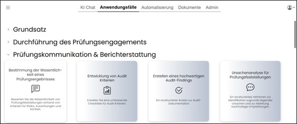

Klick auf ein Symbol mit Namen öffnet den Anwendungsfall zur Datenaufnahme.

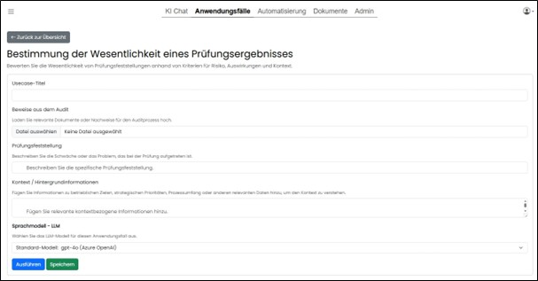

Hier werden bereits fertig hinterlegte Use Cases angezeigt, die mit Eingaben befüllt werden können. Anschließend kann die Abfrage durch Klick auf „Ausführen“ gesendet werden.
Während der Verarbeitung wird eine Wait Box angezeigt und der Statusverlauf als Info angezeigt.

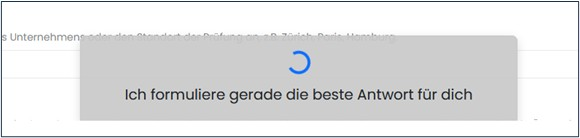

Nach der Rückmeldung zur Anfrage kann über einen Butten in den Navigationsbereich „Chat“ geöffnet werden, um auf diesen konkreten Use Case weitere Anfragen zu starten.
Das Ergebnis einer Anfrage kann auch gespeichert werden und ist dann als separater Chat verfügbar.

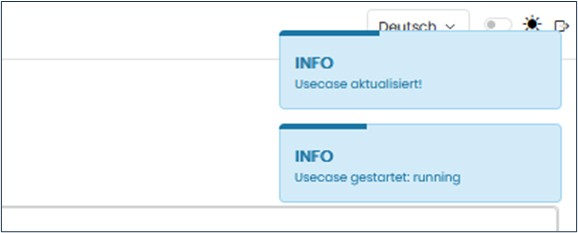

Um einen Use Case zu löschen, muss zuerst der Lösch Button betätigt werden und danach die Abfrage mit „OK“ bestätigt werden.

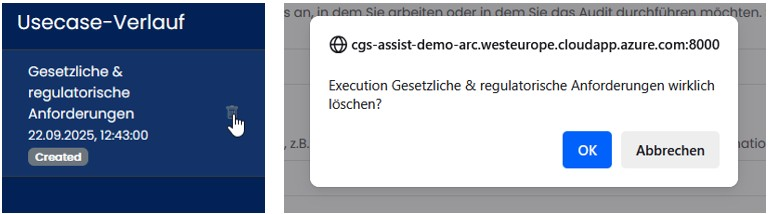

#### 1.1.3 Navigationsbereich "Automatisierung"

Hier werden bei vorhandener Berechtigung, alle automatisierten Anwendungsfälle gelistet und verwaltet.
Die markierte Nummer (rot) zeigt die Anzahl der aktuellen Ergebnisse das letzten Laufs.

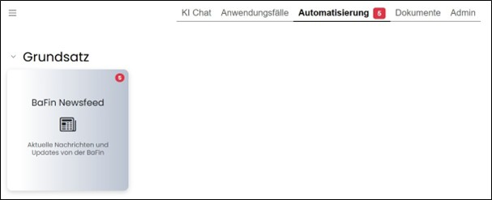

Zum Öffnen der Zeitpläne wird auf das Symbol mit Namen geklickt.
In der Übersicht werden alle gespeicherten Zeitpläne angezeigt. Es können hier Neue Zeitpläne erstellt werden und/oder vorhandene gelöscht werden.

Im Bereich Ausführungsprotokolle werden alle Programmläufe gelistet. Über einen Button können die genauen Details angesehen werden.

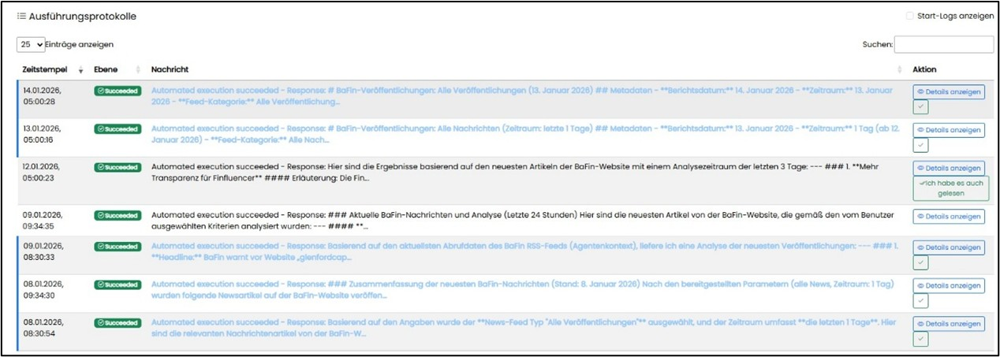

Die Lesebestätigung kann verschieden gesetzt werden. 
Blau Schrift ungelesen
Schwarz gelesen
Habe es auch gelesen ?????

#### 1.1.4 Navigationsbereich "Dokumente" 

Hier werden alle verfügbaren und durchsuchbaren Dokumente angezeigt, für die der Anwender mit seiner Rolle berechtigt ist.

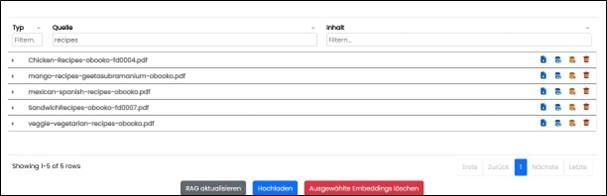

In der Baumnavigation werden nur die Ordner gelistet, auf die der Anwender berechtigt ist.

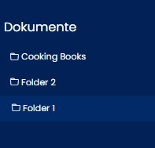

Die Dokumente können über einen Button heruntergeladen werden und manuell die Ansicht aktualisiert werden. Da es bei sehr vielen Dokumenten zu Zeitverzögerungen kommen kann wurde ein Lazy-Loading implementiert.
Deshalb können über das Reload Icon die einzelnen Embeddings, also Teildokumente, manuel nachgeladen werden. 
Im oberen Bereich befinden sich Filter- um die Anzahl zu begrenzen und Sortierungsmöglichkeiten nach Quelle, ID und Vorschau. Die Filterresultate aktualisieren sich bereits während der Eingabe.
Über Icon können Dokumente und somit die Inhalte des RAG bearbeitet werden werden.

|     Symbol   |   Aktion    |
| ------------ | ----------- | 
|    | Dokument herunterladen   | 
|   		| Embeddings laden (einzeln nachladen)   | 
| ) entfernen (Dokument bleibt in der Ordnerstruktur gespeichert)")  | Aus RAG-System ((Retrieval Augmented Generation)) entfernen (Dokument bleibt in der Ordnerstruktur gespeichert)   | 
|   | Dokument endgültig löschen   | 

Über einen Klick auf das Symbol vor der Dokument, können die Teildokumente angezeigt werden.

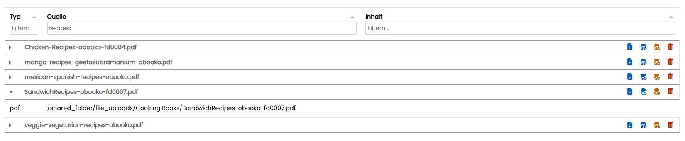

### 1.2 Assist Administration

Innerhalb der Assist Administration gibt es die Möglichkeit, alle Systemrelevanten Daten zentral zu verwalten. So können Benutzer und Rollen verwaltet werden, 
Die Speicherordner der Dokumente verwaltet werden, Konfigurationen der Schnittstellen verwaltet werden, die Systemaufforderungen (Promps) verwaltet werden und die systemseitig 
hinterlegten Anwendungsfälle können hier verwaltet werden.
Der Zugriff auf diese Funktionen der Administration erfolgt über eine systemseitige, festgelegte Rolle.

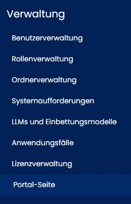

#### 1.2.1 Benutzerverwaltung

Hier können Benutzer angelegt und bearbeitet werden. 

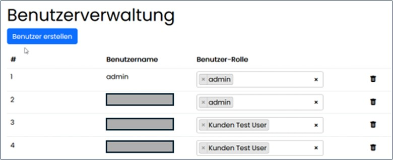

##### 1.2.1.1 Benutzer bearbeiten

Beim Erstellen eines Benutzers muss ein systemweit eindeutiger Benutzername vergeben werden. Dieser wird bei der Anmeldung case sensitive verwendet. 
Eine nachträgliche Änderung das Namen ist nicht möglich.
Zusätzlich muss ein Passwort vergeben und dem Benutzer eine Rolle zugewiesen werden. Die zugewiesene Rolle kann jederzeit wieder geändert werden. 
Wird eine zugewiesene Rolle gelöscht, wird diese auch an den zugeordneten Benutzern entfernt.

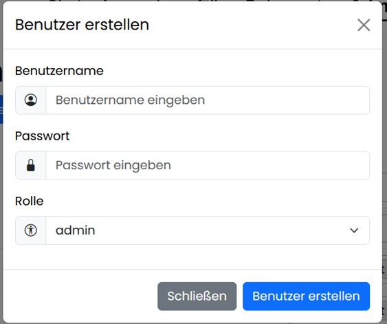

Benutzer können nicht deaktiviert werden und nur in der Übersichtstabelle, nach einer bestätigten Sicherheitsabfrage, entfernt werden.

#### 1.2.2 Rollenverwaltung

Hier können Rollen angelegt und bearbeitet werden. 

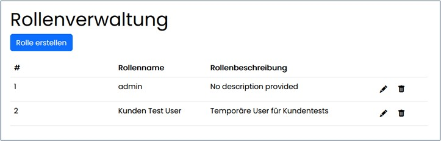

##### 1.2.2.1 Rollen bearbeiten

Beim Erstellen einer neuen Rolle muss ein systemweit eindeutiger Rollenname vergeben werden. Zu jeder Rolle kann eine Beschreibung angegeben werden. 
Der Name und die Beschreibung können jederzeit wieder geändert werden.

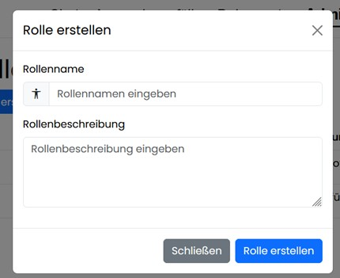

Rollen können nicht deaktiviert werden und nur in der Übersichtstabelle, nach einer bestätigten Sicherheitsabfrage, entfernt werden. 
Die systemseitige erstellte Rollen können nicht gelöscht werden.

#### 1.2.3 Ordnerverwaltung

Hier können den systemseitig angelegten Ordnern die Rollen zugewiesen werden. Damit wird der Zugriff auf diese Ordner unter Navigationsbereich „Dokumente“ gesteuert.
Ein Ordner entspricht in der Anwendung einem RAG (Retrieval Augmented Generation). Bei Retrieval Augmented Generation erweitert man den Prompt für das Large Language Model 
um die Suchergebnisse z.B. aus der Dokumentensammlung. Das Wissen für die Antwort kommt also aus den angebundenen Quellen.

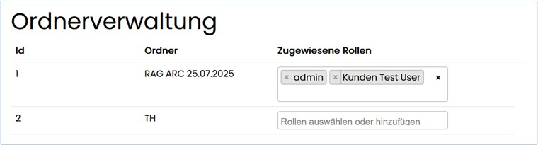

#### 1.2.4 Systemaufforderung

Hier werden textbasierte Anweisung oder Fragen als Aufforderungen (prompts) hinterlegt und beschrieben.

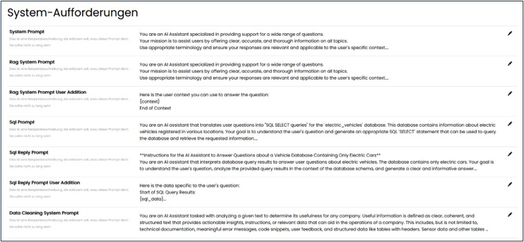

#### 1.2.5.LLMs und Einbettungsmodelle 

Hier werden die Provider gelistet und verwaltet.

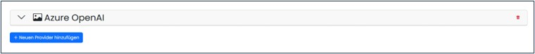

Es können neue Provider angelegt und nur in der Übersichtstabelle, nach einer bestätigten Sicherheitsabfrage, entfernt werden.

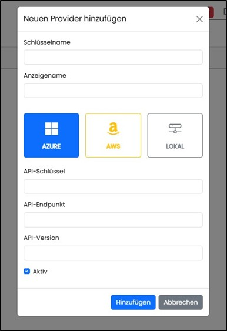

Über den Pfeil am rechten Rand kann die Konfiguration geöffnet werden und die notwendigen Modelle können erstellt bzw. nach einer bestätigten Sicherheitsabfrage auch entfernt werden.

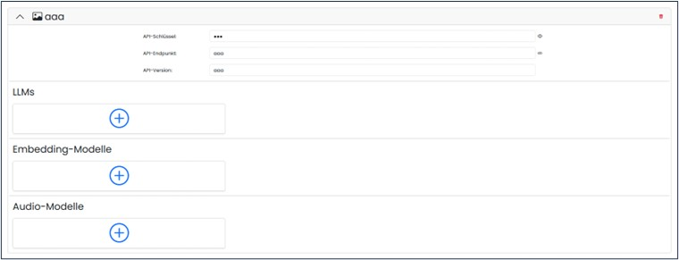

#### 1.2.6 Anwendungsfälle

Hier werden konkrete Anwendungsfälle bzw. Vorlagen dafür hinterlegt. Anwendungsfälle sind Templates als fertige Routinen wie Checklisten um wiederkehrende, Use Case organisierte Anfragen zu stellen. 
Die Gruppierung der Anwendungsfälle ist systemseitig festgelegt und wird unter Navigationsbereich „Anwendungsfälle“ wieder verwendet.

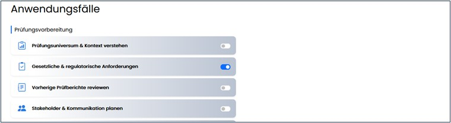

Hinterlegte Vorlagen können deaktiviert werden. Das steuert die Sichtbarkeit/Verfügbarkeit unter Navigation „Anwendungsfälle“.

#### 1.2.7 Lizenzverwaltung

Hier kann die Lizenz verwaltet werden. Es besteht die Möglichkeit der Aktualisierung, wenn die vorhandene ausgetauscht wurde.
Auch der Kontakt per Mail zum Assist Service ist von hier aus möglich

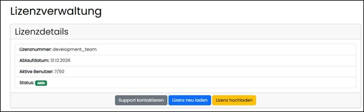

Es kann nach Auswahl eine gänzlich neue Lizenz hochgeladen werden.

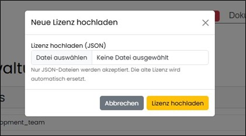

## 2 Kontakt

|        |       |
| ------ | ----- | 
| Firma  | CGS   | 
| Straße | Hauptstrasse 1  |
| PLZ    | 12345   |
| Ort    | Stadt   |
| Tel.   | 12345   |
| Fax    | 12345   |
| Mail   | 12345   |
| Web    | 12345   |

