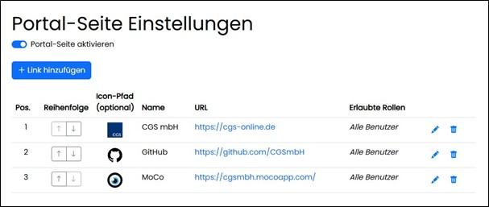
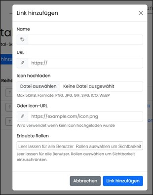

### Assist Administration

Innerhalb der Assist Administration gibt es die Möglichkeit, alle Systemrelevanten Daten zentral zu verwalten. So können hier Benutzer und Rollen, 
die Speicherordner der Dokumente (RAG), Konfigurationen der Schnittstellen, die Systemaufforderungen (Promps), LIzenzen und die systemseitig 
hinterlegten Anwendungsfälle verwaltet werden.
Der Zugriff auf diese Funktionen der Administration erfolgt über eine systemseitige, festgelegte Rolle.

image::../images/Abbildung-15.jpg[Administration, title="Administration"]

#### Benutzerverwaltung

Hier können Benutzer angelegt und bearbeitet werden. 

image::../images/Abbildung-16.jpg[Administration - Benutzerverwaltung, title="Administration - Benutzerverwaltung"]

##### Benutzer bearbeiten

Beim Erstellen eines Benutzers muss ein systemweit eindeutiger Benutzername vergeben werden. Dieser wird bei der Anmeldung case sensitive verwendet. 
Eine nachträgliche Änderung das Namen ist nicht möglich.
Zusätzlich muss ein Passwort vergeben und dem Benutzer eine Rolle zugewiesen werden. Die zugewiesene Rolle kann jederzeit wieder geändert werden. 
Wird eine zugewiesene Rolle gelöscht, wird diese auch an den zugeordneten Benutzern entfernt.

image::../images/Abbildung-17.jpg[Administration - Benutzerverwaltung - Benutzer anlegen, title="Administration - Benutzerverwaltung - Benutzer anlegen"]

Benutzer können nicht deaktiviert werden und nur in der Übersichtstabelle, nach einer bestätigten Sicherheitsabfrage, entfernt werden.

#### Rollenverwaltung

Hier können Rollen angelegt und bearbeitet werden. 

image::../images/Abbildung-18.jpg[Administration - Rollenverwaltung, title="Administration - Rollenverwaltung"]

##### Rollen bearbeiten

Beim Erstellen einer neuen Rolle muss ein systemweit eindeutiger Rollenname vergeben werden. Zu jeder Rolle kann eine Beschreibung angegeben werden. 
Der Name und die Beschreibung können jederzeit wieder geändert werden.

image::../images/Abbildung-19.jpg[Administration - Rollenverwaltung - Rollen anlegen, title="Administration - Rollenverwaltung - Rollen anlegen"]

Rollen können nicht deaktiviert werden und nur in der Übersichtstabelle, nach einer bestätigten Sicherheitsabfrage, entfernt werden. 
Die systemseitige erstellte Rollen können nicht gelöscht werden.

#### Ordnerverwaltung

Hier können den systemseitig angelegten Ordnern die Rollen zugewiesen werden. Damit wird der Zugriff auf diese Ordner unter Navigationsbereich „Dokumente“ gesteuert.
Ein Ordner entspricht in der Anwendung einem RAG (Retrieval Augmented Generation). Bei Retrieval Augmented Generation erweitert man den Prompt für das Large Language Model 
um die Suchergebnisse z.B. aus der Dokumentensammlung. Das Wissen für die Antwort kommt also aus den angebundenen Quellen.

image::../images/Abbildung-20.jpg[Administration - Ordnerverwaltung, title="Administration - Ordnerverwaltung"]

#### Systemaufforderung

Hier werden textbasierte Anweisung oder Fragen als Aufforderungen (prompts) hinterlegt und beschrieben.

image::../images/Abbildung-21.jpg[Administration - Systemaufforderungen, title="Administration - Systemaufforderungen"]

#### LLMs und Einbettungsmodelle 

Hier werden die Provider gelistet und verwaltet.

image::../images/Abbildung-22.jpg[Administration - LLMs und Einbettungsmodelle, title="Administration - LLMs und Einbettungsmodelle"]

Es können neue Provider angelegt und nur in der Übersichtstabelle, nach einer bestätigten Sicherheitsabfrage, entfernt werden.

image::../images/Abbildung-32.jpg[Administration - LLMs und Einbettungsmodelle - Provider anlegen, title="Administration - LLMs und Einbettungsmodelle - Provider anlegen"]

Über den Pfeil am rechten Rand kann die Konfiguration geöffnet werden und die notwendigen Modelle können erstellt bzw. nach einer bestätigten Sicherheitsabfrage auch entfernt werden.

image::../images/Abbildung-24.jpg[Administration - LLMs und Einbettungsmodelle - Modelle bearbeiten, title="Administration - LLMs und Einbettungsmodelle - Modelle bearbeiten"]

#### Anwendungsfälle

Hier werden konkrete Anwendungsfälle bzw. Vorlagen dafür hinterlegt. Anwendungsfälle sind Templates als fertige Routinen wie Checklisten um wiederkehrende, Use Case organisierte Anfragen zu stellen. 
Die Gruppierung der Anwendungsfälle ist systemseitig festgelegt und wird unter Navigationsbereich „Anwendungsfälle“ wieder verwendet.

image::../images/Abbildung-25.jpg[Navigationsbereich - Anwendungsfälle, title="Navigationsbereich - Anwendungsfälle"]

Hinterlegte Vorlagen können deaktiviert werden. Das steuert die Sichtbarkeit/Verfügbarkeit unter Navigation „Anwendungsfälle“.

#### Lizenzverwaltung

Hier kann die Lizenz verwaltet werden. Es besteht die Möglichkeit der Aktualisierung, wenn die vorhandene ausgetauscht wurde.
Auch der Kontakt per Mail zum Assist Service ist von hier aus möglich

image::../images/Abbildung-30.jpg[Administration - Lizenzverwaltung, title="Administration - Lizenzverwaltung"]

Es kann nach Auswahl eine gänzlich neue Lizenz hochgeladen werden.

image::../images/Abbildung-31.jpg[Administration - Lizenzverwaltung - Lizenz laden, title="Administration - Lizenzverwaltung - Lizenz laden"]

#### Portal-Seite

Hier können verschiedene Verknüpfungen verwaltet werden. Es besteht die Möglichkeit zur Neuanlage, zum Löschen und Bearbeiten einzelner Einträge.
Zusätzlich kann die gesamte Portalseite deaktiviert werden und diese ist dadurch nicht mehr in der Navigation verfügbar.

Es können Seiten oder Applikationen verknüpft werden. Die Verknüpfung von Dokumenten auf Laufwerden oder Shares ist nicht möglich.

