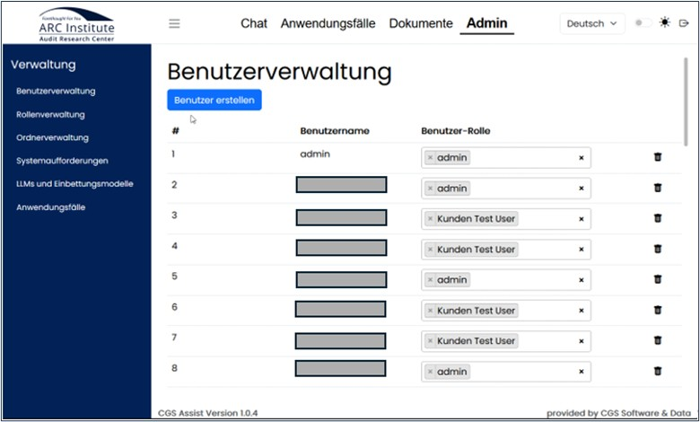

=== Anwendungsbeschreibung 

Es ist innerhalb von {application}, im weiteren nur noch Assist genannt, möglich, KI-unterstütztes Unternehmenswissen in separaten Chats oder vorbereiteten Anwendungsfällen abzufragen und zu nutzen. 
Dieses Wissen basiert, je nach Einstellung, auf den Inhalten der hinterlegten Dokumente oder einer Cloud.

Alle Chatverläufe werden nur im Browser Storage gespeichert und sind nach dem Browser schließen (Wenn Einstellung "automatischem Cache leeren") und der Neuanmeldung nicht weiter verfügbar.
Alle gespeicherten Use Case Verläufe können auch nach dem Browser schließen und der Neuanmeldung wieder geöffnet werden.

Bestimmte regelmäßige Anwendungsfälle werden im Assist als Templates verwaltet, um Routinen zu vereinfachen. Die Anwendungsfälle sind mit Use Cases wie eine Art Checkliste erstellt.
Es können bei entsprechender Berechtigung, automatisierte, zeitgesteurte Abfragen auf automatisierte bereitgestellte Informationsquellen, sogenannte Feeds erstellt werden.

ifdef::cgs-assist[]
image::../images/cgs-Abbildung-start.jpg[CGS Assist,title="CGS Assist", width=400]
endif::cgs-assist[]

ifdef::arc-assist[]

endif::arc-assist[]

Über eine Navigation am oberen Rand sind die thematisierten Navigationsbereiche erreichbar.
Je nach Berechtigungen des Anwenders können die Anzahl der Einträge bzw. das Design variieren.

image::../images/Abbildung-1.jpg[Navigationsbereiche, title="Navigationsbereiche", width=400]

Unterseiten dieser Navigationsbereiche sind dann jeweils über die Baumnavigation am linken Rand erreichbar.

image::../images/Abbildung-2.jpg[Navigationsbereich - Baumnavigation, title="Navigationsbereich - Baumnavigation", width=400]

Zusätzlich kann über ein Symbol am rechten oberen Rand die Auswahl der Sprache innerhalb der Anwendung getroffen werden und die Ansicht in den Dark Mode, bzw. wieder zurück, gewechselt werden. 
Auch können die Profildaten eingesehen werden bzw. eine Änderung des persönlichen Passwortes ist hier möglich.

image::../images/Abbildung-3.jpg[Sprachwechsel und Darkmode, title="Sprachwechsel und Darkmode", width=400]

Innerhalb der gesamtem Anwendung werden beim Ausführen von Aktionen in der oberen linken Ecke farbige Hinweisdialoge angezeigt.
Die Farben kennzeichnen das Hinweislevel wie folgt:

|===
|grün	| Erfolgreiche Ausführung der Aktion
|blau	| Allgemeiner Hinweis über der Aktion
|rot	| Fehler bei Ausführung der Aktion
|=== 

image::../images/Abbildung-confirm.jpg[Hinweise, title="Hinweise", width=400]