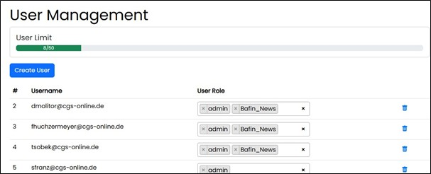

=== Assist Administration

Within Assist Administration, there is the possibility to centrally manage all system-relevant data. Here, users and roles, 
the document storage folders (RAG), interface configurations, system prompts, licenses, and the system-side 
stored use cases can be managed.
Access to these administration functions is granted via a system-defined, pre-configured role.

image::../images/Abbildung-15.jpg[Administration, title="Administration", width=150]

==== User Management

Here, users can be created and edited. 

===== Edit User

When creating a user, a system-wide unique username must be assigned. This is used case sensitive during login. 
Subsequent changes to the username are not possible.
In addition, a name, a password must be assigned and a role must be given to the user. The assigned role can be changed at any time.
User name editing or changing ist not possible.If an assigned role is deleted, it is also removed from the associated users.

image::../images/Abbildung-17.jpg[Administration - User Management - create user, title="Administration - User Management - create user", width=400]

Users cannot be deactivated and can only be removed in the overview table after a confirmed security prompt.

==== Role Management

Here, roles can be created and edited. 

image::../images/Abbildung-18.jpg[Administration - Role Management, title="Administration - Role Management", width=400]

===== Edit Role

When creating a new role, a system-wide unique role name must be assigned. Each role can have a description. 
The name and the description can be changed at any time.

image::../images/Abbildung-19.jpg[Administration - Role Management - edit role, title="Administration - Role Management - edit role", width=400]

Roles cannot be deactivated and can only be removed in the overview table after a confirmed security prompt.
System-defined roles cannot be deleted.

==== Folder Management

Here, roles can be assigned to the folders created by the system. This controls access to these folders under the "Documents" navigation area.
A folder corresponds in the application to a RAG (Retrieval Augmented Generation). With Retrieval Augmented Generation, you extend the prompt for the Large Language Model 
with search results, e.g., from the document collection. Therefore, the knowledge for the answer comes from the connected sources.

image::../images/Abbildung-20.jpg[Administration - Folder Management, title="Administration - Folder Management", width=400]

==== System Prompts

Here, text-based instructions or questions are stored and described as prompts.

image::../images/Abbildung-21.jpg[Administration - System Prompts, title="Administration - System Prompts", width=400]

==== LLMs and Embedding Models

Here, the providers are listed and managed.

image::../images/Abbildung-22.jpg[Administration - LLMs and Embedding Models, title="Administration - LLMs and Embedding Models", width=400]

New providers can be created and can only be removed in the overview table after a confirmed security prompt.

image::../images/Abbildung-32.jpg[Administration - LLMs and Embedding Models - Create Provider, title="Administration - LLMs and Embedding Models - Create Provider", width=400]

By clicking the arrow on the right edge, the configuration can be opened and the required models can be created or removed after a confirmed security prompt.

image::../images/Abbildung-24.jpg[Administration - LLMs and Embedding Models - Edit Models, title="Administration - LLMs and Embedding Models - Edit Models", width=400]

==== Use Cases

Here, concrete use cases or templates for them are stored. Use Cases are templates for ready-made routines like checklists to make recurring, use-case-organized requests. 
The grouping of the use cases is defined by the system and is reused under the navigation area "Use Cases".

image::../images/Abbildung-25.jpg[Administration - Use Cases, title="Administration - Use Cases", width=400]

Stored templates can be deactivated. This controls the visibility/availability under "Use Cases" in the navigation.

==== License Management

Here, the license can be managed. There is the possibility to update it if the existing license has been replaced.
Contacting the Assist Service by mail is also possible from here.

image::../images/Abbildung-30.jpg[Administration - License Management, title="Administration - License Management", width=400]

A completely new license can be uploaded after selection.

image::../images/Abbildung-31.jpg[Administration - License Management - Upload License, title="Administration - License Management - Upload License", width=400]

==== Portal Page

Here, various links can be managed. It is possible to add, delete and edit individual entries.
Additionally, the entire portal page can be deactivated, making it unavailable in the navigation.

image::../images/Abbildung-41.jpg[Administration - Portal page, title="Administration - Portal page", width=400]

Pages or applications can be linked. Linking documents on drives or shares is not possible.

image::../images/Abbildung-42.jpg[Administration - Portal Page - create link, title="Administration - Portal page - create link", width=250]
